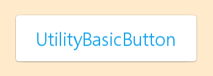
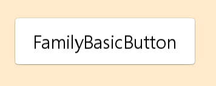

# Button
This tutorial describes how to create and use button.

## Overview
Button is one kind of common component and clearly describes what action will occur when user select it.

- Button can contain text or icon.
- Button can be created by property or attributes.

## Create with property
1. Create Button by default constructor

~~~{.cs}
utilityBasicButton = new Button();
~~~

2. Set button property

~~~{.cs}
utilityBasicButton.IsSelectable = true;
utilityBasicButton.BackgroundImageURL = "rectangle_btn_normal.png";
utilityBasicButton.BackgroundImageBorder = new Rectangle(5, 5, 5, 5);
utilityBasicButton.ShadowImageURL = "rectangle_btn_shadow.png";
utilityBasicButton.ShadowImageBorder = new Rectangle(5, 5, 5, 5);
utilityBasicButton.OverlayImageURLSelector = new StringSelector
{
    Pressed = "rectangle_btn_press_overlay.png",
    Other = ""
};
utilityBasicButton.OverlayImageBorder = new Rectangle(5, 5, 5, 5);

utilityBasicButton.TextColorSelector = new ColorSelector
{
    Normal = new Color(0, 0, 0, 1),
    Pressed = new Color(0, 0, 0, 0.7f),
    Selected = new Color(0.058f, 0.631f, 0.92f, 1),
    Disabled = new Color(0, 0, 0, 0.4f)
};

utilityBasicButton.Size2D = new Size2D(300, 80);
utilityBasicButton.Position2D = new Position2D(100, 300);
utilityBasicButton.PointSize = 20;
utilityBasicButton.Text = "UtilityBasicButton";
root.Add(utilityBasicButton);
~~~

Button created by property:

Button created by property pressed:

## Create with attributes
1. Create button attributes

~~~{.cs}
ButtonAttributes familyBasicButtonAttributes = new ButtonAttributes
{
    IsSelectable = true,
    BackgroundImageAttributes = new ImageAttributes
    {
        ResourceURL = new StringSelector { All = "rectangle_btn_normal.png" },
        Border = new RectangleSelector { All = new Rectangle(5, 5, 5, 5) }
    },

    ShadowImageAttributes = new ImageAttributes
    {
        ResourceURL = new StringSelector { All = "rectangle_btn_shadow.png" },
        Border = new RectangleSelector { All = new Rectangle(5, 5, 5, 5) }
    },

    OverlayImageAttributes = new ImageAttributes
    {
        ResourceURL = new StringSelector { Pressed = "rectangle_btn_press_overlay.png", Other = "" },
        Border = new RectangleSelector { All = new Rectangle(5, 5, 5, 5) },
    },

    TextAttributes = new TextAttributes
    {
        PointSize = new FloatSelector { All = 20 },
        HorizontalAlignment = HorizontalAlignment.Center,
        VerticalAlignment = VerticalAlignment.Center,
        WidthResizePolicy = ResizePolicyType.FillToParent,
        HeightResizePolicy = ResizePolicyType.FillToParent,

        TextColor = new ColorSelector
        {
            Normal = new Color(0, 0, 0, 1),
            Pressed = new Color(0, 0, 0, 0.7f),
            Selected = new Color(0.141f, 0.769f, 0.278f, 1),
            Disabled = new Color(0, 0, 0, 0.4f),
        },
    }
};
~~~

2. Use the attributes to create a button and add button to parent

~~~{.cs}
familyBasicButton = new Button(familyBasicButtonAttributes);
familyBasicButton.Size2D = new Size2D(300, 80);
familyBasicButton.Position2D = new Position2D(100, 300);
familyBasicButton.PointSize = 20;
familyBasicButton.Text = "FamilyBasicButton";
root.Add(familyBasicButton);
~~~

Button created by attributes:

Button created by attributes pressed:

## Create with defined styles
You can define a style according to the UX, then you can use the this style to ceate a button.

1. User define a custom style as the whole view.

~~~{.cs}
internal class CustomButtonStyle : StyleBase
{
  protected override Attributes GetAttributes()
  {
      ButtonAttributes attributes = new ButtonAttributes
      {
          IsSelectable = true,
          BackgroundImageAttributes = new ImageAttributes
          {
              ResourceURL = new StringSelector { All = "rectangle_btn_normal.png" },
              Border = new RectangleSelector { All = new Rectangle(5, 5, 5, 5) }
          },

          ShadowImageAttributes = new ImageAttributes
          {
              ResourceURL = new StringSelector { All = "rectangle_btn_shadow.png" },
              Border = new RectangleSelector { All = new Rectangle(5, 5, 5, 5) }
          },

          OverlayImageAttributes = new ImageAttributes
          {
              ResourceURL = new StringSelector { Pressed = "rectangle_btn_press_overlay.png", Other = "" },
              Border = new RectangleSelector { All = new Rectangle(5, 5, 5, 5) },
          },

          TextAttributes = new TextAttributes
          {
              PointSize = new FloatSelector { All = 20 },
              HorizontalAlignment = HorizontalAlignment.Center,
              VerticalAlignment = VerticalAlignment.Center,
              WidthResizePolicy = ResizePolicyType.FillToParent,
              HeightResizePolicy = ResizePolicyType.FillToParent,

              TextColor = new ColorSelector
              {
                  Normal = new Color(0, 0, 0, 1),
                  Pressed = new Color(0, 0, 0, 0.7f),
                  Selected = Utility.Hex2Color(Constants.APP_COLOR_UTILITY, 1),
                  Disabled = new Color(0, 0, 0, 0.4f),
              },
          }
      };
      return attributes;
  }
}
~~~

2. Register your custom style.

~~~{.cs}
StyleManager.Instance.RegisterStyle("CustomButton", null, typeof(YourNameSpace.CustomButtonStyle));
~~~

3. Use your custom style to create a button instance

~~~{.cs}
familyBasicButton = new Button("CustomButton");
familyBasicButton.Size2D = new Size2D(300, 80);
familyBasicButton.Position2D = new Position2D(100, 300);
familyBasicButton.PointSize = 20;
familyBasicButton.Text = "BasicButton";
root.Add(familyBasicButton);
~~~

Button created by style:

Button created by style pressed:

## Responding to ClickEvent
When user click a button, the Button instance receives a click event.
You can declare the click event handler as following:

~~~{.cs}
Button button = new Button();
button.ClickEvent += OnClick;
private void OnClick(object sender, Button.ClickEventArgs e)
{
    // Do something in response to button click
}
~~~

## Responding to StateChangedEvent
Button has 8 states including Normal, Focused, Disabled, Selected, Pressed, DisabledFocused, SelectedFocused and DisabledSelected.
When the user change button state ( change focus or disable a button), the Button instance receives an StateChangedEvent.

~~~{.cs}
Button button = new Button();
button.StateChangedEvent += OnStateChange;
private void OnStateChange(object sender, Button.StateChangeEventArgs e)
{
    // Do something in response to state change
}
~~~
